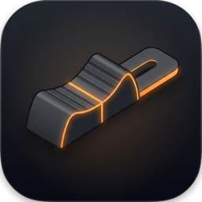
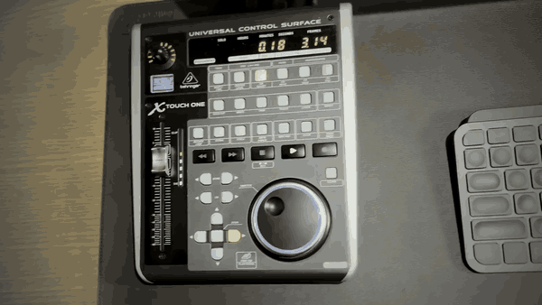
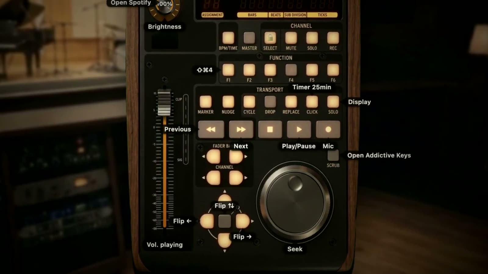

  

<h1 align="center">MidiPanel</h1>

  <b>Turn any MIDI controller into a panel that controls your whole Mac, beyond the DAW.</b>

  <a href="https://midipanel.com/downloads/MidiPanel.dmg?ref=github"><b>⬇ Download the free trial (.dmg)</b></a>
  &nbsp;·&nbsp;
  <a href="https://midipanel.com/?ref=github">Website</a>
  &nbsp;·&nbsp;
  <a href="https://midipanel.com/manual?ref=github">Manual</a>
  &nbsp;·&nbsp;
  <a href="https://midipanel.com/faq?ref=github">FAQ</a>

  macOS 12+ · Apple Silicon & Intel · signed and notarized by Apple · 7 days free, no card, no account

  

---

## Why it exists

For a long time I looked for an app that could make my MIDI controller useful after I closed the DAW: control the Spotify and YouTube volume, mute myself, turn on my mic in a meeting, open a specific app. I didn't find one that did all of it, so I built MidiPanel.

## What your controller does on the Mac

- **Move a fader** and the volume of whatever is playing changes: Spotify, Apple Music or a YouTube tab in Chrome. It works even with an audio interface.
- **Press Play, Next or Previous** on the controller and Spotify, Apple Music or YouTube follow. **Spin the jog wheel** to scrub through the song.
- **Press a button in a meeting** to mute your mic, turn the camera off or raise your hand in Google Meet, Zoom or Microsoft Teams. Leaving the call needs a 1-second hold, so you never drop out by accident.
- **Turn a knob** to set the screen brightness.
- **Press a button** to open a specific app, fire a keyboard shortcut (for example ⌘⇧4 for a screenshot), run an Apple Shortcut or snap the front window to a half or a quarter of the screen.
- **Start a 25-minute focus timer** that counts down on the controller's time display.
- **Clean your keyboard:** a cleaning mode switches the keyboard off while you wipe it, with a big countdown on screen.

## Your controller answers back

On mapped models, the controller doesn't only send commands. It syncs with the Mac and shows what is happening:

- **The motorized fader follows the Spotify volume.** Change the volume in Spotify or with the Mac's volume keys, and the fader moves by itself to match.
- **The song title and artist show up on the controller's display**, then the volume or brightness level while you turn a knob, and what a button just did.
- **The time display** shows the clock, the song time or the focus-timer countdown.
- **The Play LED** is lit while music plays and blinks on pause. **Knob rings** show the real brightness level.
- **Faders without a motor** use pick-up: if the Mac is at 20% and the fader sits at 0, nothing jumps. The fader takes over when it reaches 20%.

## Set it up by clicking a photo of your controller

  

Click the control you see on screen and pick what it does. Its light blinks on the hardware until you save. No table of notes, CCs and channels. Close the window and the controller keeps working from the menu bar.

## Supported controllers

**Any USB or Bluetooth MIDI controller works for actions and shortcuts:** press a control and MidiPanel learns it. Then build your own on-screen layout.

Ten models also have a full layout with lights and displays:

| Controller | Status |
|---|---|
| Behringer X-Touch One | Lights, display, motorized fader. Tested on real hardware |
| M-VAVE SMC-Mixer | Lights and faders. Tested on real hardware |
| Behringer X-Touch · X-Touch Compact · X-Touch Mini | Beta |
| PreSonus FaderPort 8 · FaderPort 2 | Beta |
| iCON Platform M+ · QCon Pro G2 | Beta |
| Korg nanoKONTROL2 | Beta |

**Beta** means the layout comes from the manufacturer's manual and MIDI protocol and was tested in an emulator, not on that exact device yet. The free trial tells you in minutes. Own a beta model? The first 2 people who test each one get a free license: [details](https://midipanel.com/supported-controllers?ref=github).

Your controller is not on the list? [Open an issue](https://github.com/midipanel/midipanel/issues/new) with the model name.

## Install

1. [Download the .dmg](https://midipanel.com/downloads/MidiPanel.dmg?ref=github) (also under [Releases](https://github.com/midipanel/midipanel/releases/latest)).
2. Open it and drag MidiPanel to the Applications folder.
3. Open MidiPanel. The welcome screen guides you through the **Accessibility** and **Automation** permissions.
4. To control YouTube volume and seek in Chrome, turn on **View → Developer → Allow JavaScript from Apple Events** in Chrome.

**Requirements:** macOS 12 Monterey or later (the level meter needs macOS 14.2 or later). Apple Silicon or Intel.

**Mac only for now.** A Windows version depends on demand: if you want one, [open an issue](https://github.com/midipanel/midipanel/issues/new) and say so.

## Price

**US$19, one-time.** No subscription. Taxes included. Use it on up to 3 of your Macs. Your trial mappings stay when you buy. Full refund within 14 days.

[Buy MidiPanel](https://midipanel.com/?ref=github#pricing)

## Privacy

No account. No telemetry. Your mappings stay on your Mac. Volume moves only when you move a control. Your DAW's virtual MIDI never triggers actions.

## Help and feedback

- **Bugs and controller requests:** [open an issue](https://github.com/midipanel/midipanel/issues).
- **License, payment and anything private:** support@midipanel.com.
- **Answers first:** [FAQ](https://midipanel.com/faq?ref=github) and [manual](https://midipanel.com/manual?ref=github).

This repository holds the releases and the issue tracker. The source code is not public.

## Em português

O MidiPanel transforma o seu controlador MIDI num painel de controle do Mac: volume do Spotify, mudo no Meet, brilho da tela e qualquer atalho. Teste grátis de 7 dias, sem cartão. Compra única de R$ 79 no Brasil. Site em português: [midipanel.com](https://midipanel.com/?ref=github) (botão PT no topo).

---

Made in São Paulo by Fernando Diniz.

MidiPanel is not affiliated with Behringer, M-VAVE, PreSonus, iCON or Korg. Product names are trademarks of their owners and are used only to describe compatibility.
